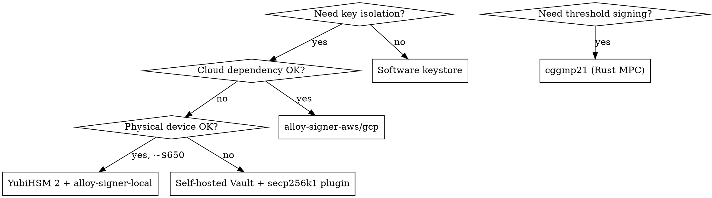

# Server Wallet and HSM Key Management

## Overview

Reference for choosing and integrating hardened server-side key management for secp256k1 (Ethereum/Bitcoin). Covers the spectrum from software-only to full HSM, ranked by minimalism and auditability.

## When to Use

- Selecting a signing backend for a new service
- Upgrading from env-var key storage to HSM-backed signing
- Evaluating cloud KMS vs physical HSM vs self-hosted Vault
- Adding threshold/MPC signing to an existing service

## Decision Tree

## Quick Reference: Backends by Minimalism

| Backend | Language | HSM | Software fallback | Audited | Codebase |
|---|---|---|---|---|---|
| `alloy-signer-local` (yubihsm feature) | Rust | YubiHSM 2 | mnemonic/keystore | k256: NCC Group | Tiny (trait + impl) |
| `alloy-signer-aws` | Rust | AWS KMS | n/a | k256: NCC Group | Tiny |
| `alloy-signer-gcp` | Rust | GCP Cloud KMS | n/a | k256: NCC Group | Tiny |
| tmkms | Rust | YubiHSM 2, Fortanix DSM | softsign (encrypted file) | Yes (1 low finding) | ~5-10k LOC |
| vault-plugin-secp256k1 | Go | Via Vault Enterprise seal | Vault encrypted storage | No external audit | Small plugin |
| Web3Signer | Java | Azure Key Vault | Keystore files | Internal ConsenSys only | 30-50k+ LOC |
| cggmp21 | Rust | n/a (MPC replaces HSM) | Pure software | Kudelski Security | Focused MPC lib |

## Cloud KMS secp256k1 Support

All three major clouds support secp256k1:

| Provider | Key Spec | Notes |
|---|---|---|
| AWS KMS | `ECC_SECG_P256K1` | Most battle-tested for ETH. DER-to-ETH sig conversion needed. |
| GCP Cloud KMS | `ec-sign-secp256k1-sha256` | Non-deterministic nonce. |
| Azure Key Vault | `P-256K` / `ES256K` | SDK naming inconsistency between portal and SDK. |
| YubiHSM 2 | Native PKCS#11 | FIPS 140-2 Level 3 (FIPS variant). ~$650/device. |

## Rust Integration Patterns

### alloy-signer (recommended for Ethereum)

The `Signer` and `SignerSync` traits from alloy are the standard Rust abstraction. Backend crates are composable:

- `alloy-signer-local`: software keys via k256, optional `yubihsm` feature
- `alloy-signer-aws`: AWS KMS
- `alloy-signer-gcp`: GCP Cloud KMS

### RustCrypto k256 (lowest level)

Pure Rust secp256k1. The `signature::Signer` trait is designed so HSM wrappers can implement signing without local key material. NCC Group audited.

### tmkms architecture (reference for custom daemon)

If building a standalone signing daemon: tmkms's HSM abstraction layer (YubiHSM 2 + Fortanix + softsign backends) with double-signing prevention is the closest Rust reference. Strip Tendermint protocol, wire in alloy's Ethereum tx signing.

## Threshold / MPC

**LFDT-Lockness/cggmp21** (MIT/Apache-2.0, Rust, `no_std`): State-of-the-art t-of-n threshold ECDSA over secp256k1. Audited by Kudelski Security. Originated at Dfns, donated to Linux Foundation. Use when no single party should hold the full key.

## Common Mistakes

- Assuming cloud KMS returns Ethereum-format signatures directly (they return DER; you must convert and recover the v-bit)
- Running Vault without auto-unseal configuration (manual unseal after every restart)
- Choosing MPC when a single HSM-backed key suffices (MPC adds operational complexity)
- Using Web3Signer for a single-key service (massive overhead for what you need)
